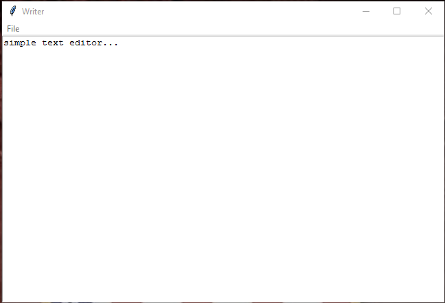

A simple text editor application made for fun and practice with Python 3.5.2 using the Tkinter module for GUI programming.
Author: Leo Hajder (github.com/lhajder)

TO DO: Check if file is saved before quitting or opening new file.
